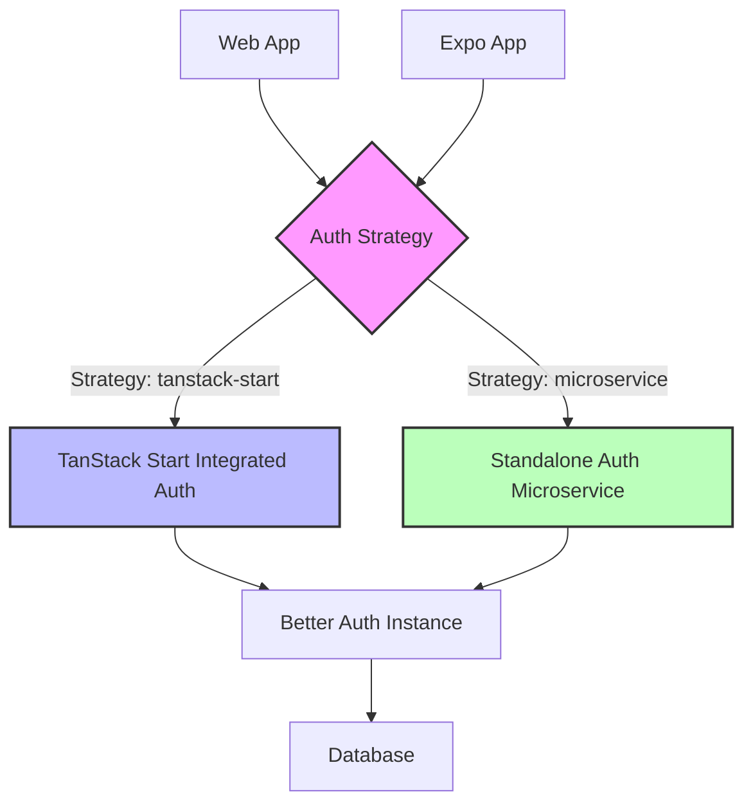

# Flexible OAuth Proxy Architecture

This monorepo implements a **flexible OAuth proxy architecture** that allows developers to choose between two authentication routing patterns while maintaining **full type safety** across web and mobile clients.

## Architecture Overview



## Two Authentication Patterns

### 1. TanStack Start OAuth Proxy (Integrated) 
**Best for**: Simpler deployments, fewer moving parts

- Auth routes integrated into main TanStack Start app
- Server-side: Direct function calls (no HTTP overhead)
- Client-side: HTTP requests to same origin
- Single deployment unit

```typescript
const integratedConfig = createAuthProxyConfig({
  strategy: "tanstack-start",
  tanstackStart: {
    authBasePath: "/api/auth",
    enableSessionProxy: true,
  },
});
```

### 2. Microservice OAuth Proxy (Distributed)
**Best for**: Scalable architectures, auth service reuse

- Auth routes in standalone Elysia microservice  
- Both server/client use HTTP to dedicated auth service
- Separate deployment and scaling
- Reusable across multiple applications

```typescript
const microserviceConfig = createAuthProxyConfig({
  strategy: "microservice", 
  microservice: {
    baseUrl: "http://localhost:3001",
    authBasePath: "/api/auth",
    enableCrossOrigin: true,
  },
});
```

## Type Safety Guarantees

✅ **Full end-to-end type safety** with Eden Treaty  
✅ **Same API surface** regardless of routing strategy  
✅ **Automatic client generation** for web and mobile  
✅ **Runtime strategy switching** without code changes  

## Implementation Examples

### Environment-Based Strategy Selection

```typescript
// Automatically choose strategy based on environment
export function createAdaptiveAuthClient(app?: any) {
  const useIntegrated = process.env.AUTH_STRATEGY !== "microservice";
  
  if (useIntegrated) {
    return createIntegratedWebClient(app);
  } else {
    return createMicroserviceWebClient();
  }
}
```

### Feature Flag Controlled Routing

```typescript
// Switch auth routing via feature flags
export function createFeatureFlagAuthClient(app?: any) {
  const enableMicroserviceAuth = process.env.FEATURE_MICROSERVICE_AUTH === "true";
  
  return createConfigurableAuthClient(
    enableMicroserviceAuth ? "microservice" : "integrated",
    app
  );
}
```

### Multi-Environment Configuration

```typescript
export const authConfigs = {
  development: createAuthProxyConfig({ strategy: "tanstack-start" }),
  staging: createAuthProxyConfig({ strategy: "microservice" }),
  production: createAuthProxyConfig({ 
    strategy: "microservice",
    microservice: {
      baseUrl: "https://auth.myapp.com",
      authBasePath: "/api/auth", 
      enableCrossOrigin: true,
    },
  }),
} as const;
```

## Expo Integration

**Works identically with both strategies!**

```typescript
// Same code works for integrated OR microservice auth
const authClient = createExpoClient(authConfig);

// All auth operations work the same way
const session = await authClient.auth.session.get();
const user = await authClient.auth.me.get();
const status = await authClient.auth.status.get();
```

The Expo client automatically:
- 🔄 Adapts to the configured auth strategy
- 🌐 Handles cross-origin requests properly  
- 📱 Works across iOS, Android, and web
- 🔐 Maintains secure credential handling

## Shared Service Templates

Create new microservices easily with consistent patterns:

```typescript
// Basic service template
const app = createServiceTemplate({
  serviceName: "my-service",
  trustedOrigins: ["http://localhost:3000"]
});

// Full microservice with decorations  
const fullApp = createMicroservice({
  serviceName: "my-service",
  auth: authInstance,
  db: dbInstance, 
  logger: loggerInstance
});
```

## Migration Path

### Start Integrated → Move to Microservice

1. **Phase 1**: Start with integrated auth (simpler)
```typescript
const config = createAuthProxyConfig({ strategy: "tanstack-start" });
```

2. **Phase 2**: Deploy microservice auth alongside
```typescript 
const config = createAuthProxyConfig({ strategy: "microservice" });
```

3. **Phase 3**: Switch clients via environment variable
```typescript
const strategy = process.env.AUTH_STRATEGY || "tanstack-start";
```

4. **Phase 4**: Remove integrated auth once validated

**Zero client code changes required!**

## Benefits

### For Developers
- 🎯 **Choose the right pattern** for your use case
- 🔧 **Switch strategies** without rewriting clients  
- 📊 **Full TypeScript** support and autocompletion
- 🚀 **Gradual migration** path between patterns

### For Operations  
- 📈 **Scale auth independently** with microservice pattern
- 🔄 **Blue/green deployments** for auth service updates
- 📦 **Simpler deployments** with integrated pattern
- 🛡️ **Consistent security** across all applications

## Real-World Usage

### Startup → Scale Journey

**Early Stage**: Use integrated pattern for simplicity
```typescript
// Single deployment, easier development
const config = createAuthProxyConfig({ strategy: "tanstack-start" });
```

**Growth Stage**: Switch to microservice for scale
```typescript  
// Independent scaling, multi-app reuse
const config = createAuthProxyConfig({ strategy: "microservice" });
```

**Enterprise Stage**: Advanced routing strategies
```typescript
// Load balancer, multiple regions, A/B testing
const config = createAuthProxyConfig({
  strategy: "microservice",
  microservice: {
    baseUrl: loadBalancer.getAuthServiceUrl(),
    enableCrossOrigin: true,
  },
});
```

## Getting Started

1. **Choose your initial strategy**:
   - Simple deployment → `tanstack-start`  
   - Microservice architecture → `microservice`

2. **Configure auth proxy**:
```typescript
import { createAuthProxyConfig } from "@acme/api";

const authConfig = createAuthProxyConfig({
  strategy: "tanstack-start", // or "microservice"
});
```

3. **Create clients**:
```typescript
// Web client
const webAuth = createWebAuthClient(authConfig, app);

// Expo client  
const expoAuth = createExpoAuthClient(authConfig);
```

4. **Use consistently**:
```typescript
// Same API across all clients and strategies
const session = await client.auth.session.get();
```

## Summary

This flexible OAuth proxy architecture gives you the **best of both worlds**:

- **Start simple** with integrated auth
- **Scale complex** with microservice auth  
- **Zero breaking changes** when switching
- **Full type safety** across all patterns
- **Universal Expo support** for mobile apps

**The ultimate goal**: Route auth requests through your preferred architecture while maintaining identical client code and full type safety across web and mobile applications.